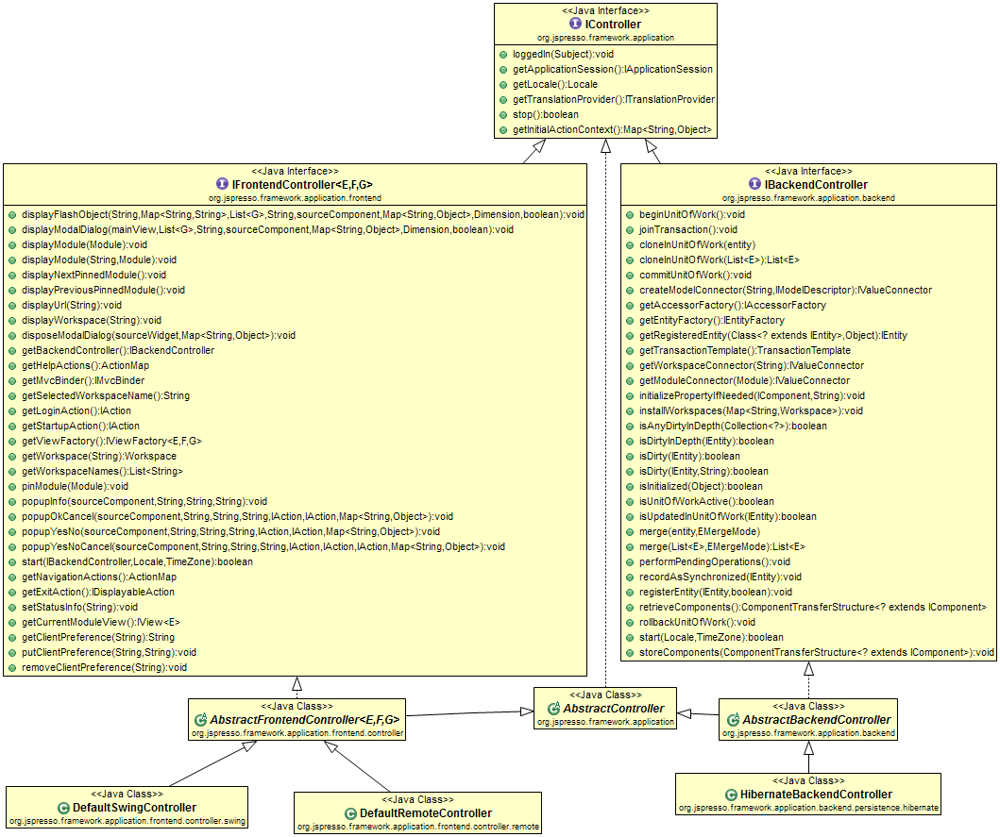
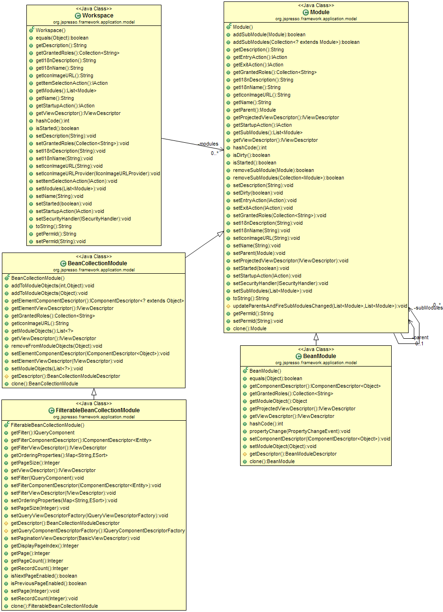
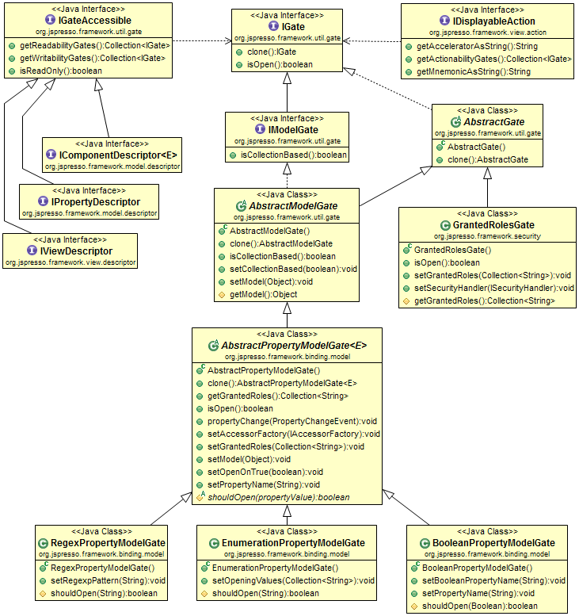
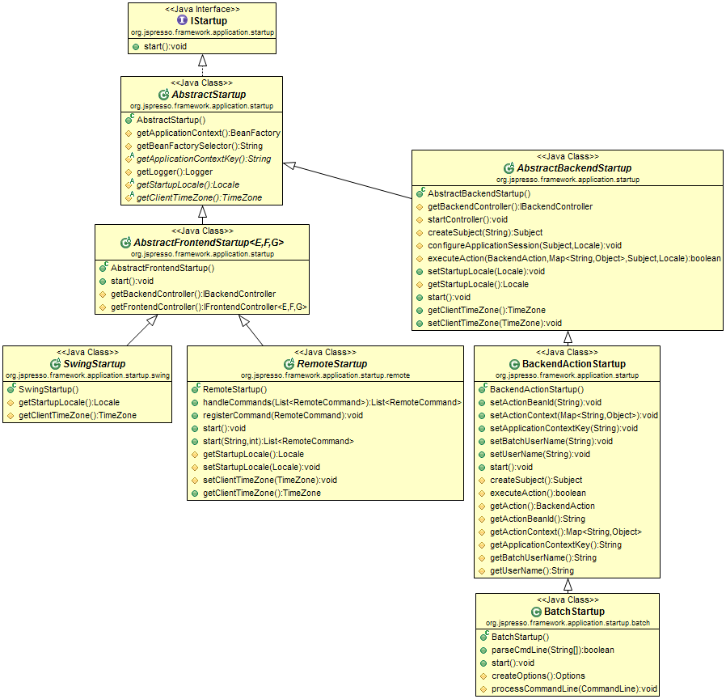

Application Structure
=====================

<!-- toc -->

Controllers
===========

Overview
--------

Reference
---------
!INCLUDE "../generated/AbstractController.md"

Modules
=======

Overview
--------

Reference
---------
!INCLUDE "../generated/Workspace.md"
!INCLUDE "../generated/Module.md"

Enabling/Disabling
==================

Jspresso goes beyond static, role-based, authorization by introducing
the concept of *gate*. A gate is a simple monitor that can open or close
based on certain (dynamic) rules. Jspresso relies on gates to implement
dynamic authorization that are most often based on some kind of model
sate.

There are various places in Jspresso where dynamic authorization can be
implemented :

-   *model writability* : once a model instance is determined to be
    read-only, all views on this model are also made.

-   *view writability* : same as above but only applies to a single
    view.

-   *action enablement* : enables / disable actions based on the model
    of the view they are installed in.

Wherever you want to use dynamic authorization, you can always combine
gates. The combination is conjunctive, meaning that *all* gates must be
open for the property (writability, actionability) to be allowed. In
other words, a single closed gate is sufficient to forbid the property.

Overview
--------

Reference
---------
!INCLUDE "../generated/AbstractGate.md"

Startup
=======

Overview
--------

